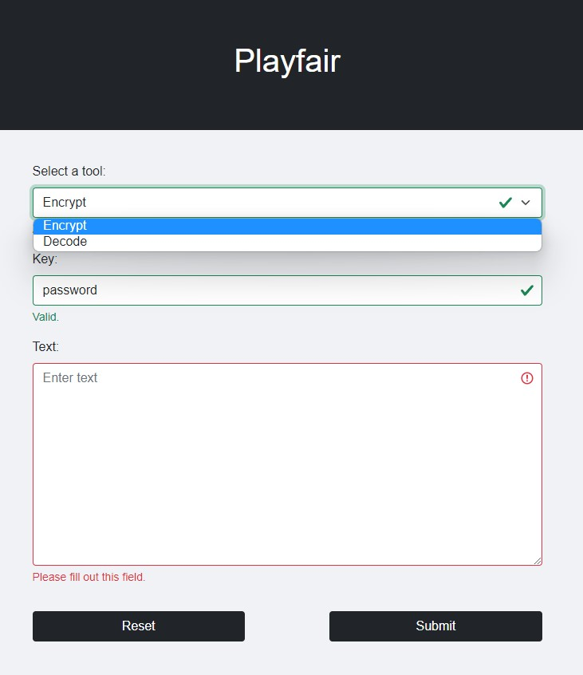
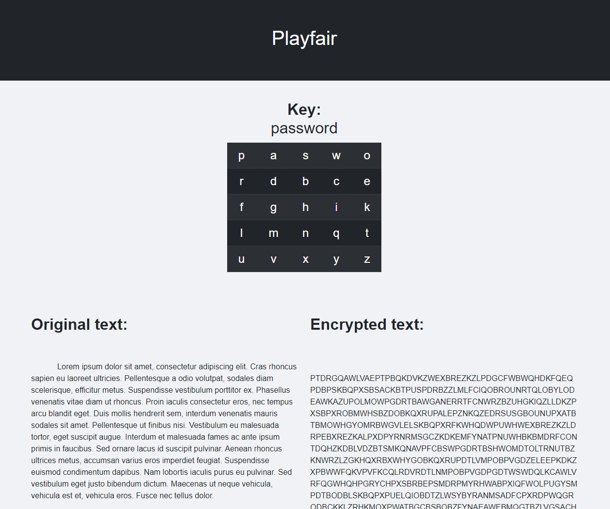

# Playfair
Flask application for encryption and decryption text using playfair cipher. 

## Running application
Install the libraries if you don't have them yet on your computer.
```
pip install flask
```
Then go to the directory with app.py file and type in command line:
```
python app.py
```
The server start on the default localhost 5000 port -> http://127.0.0.1:5000/

## App appearance

